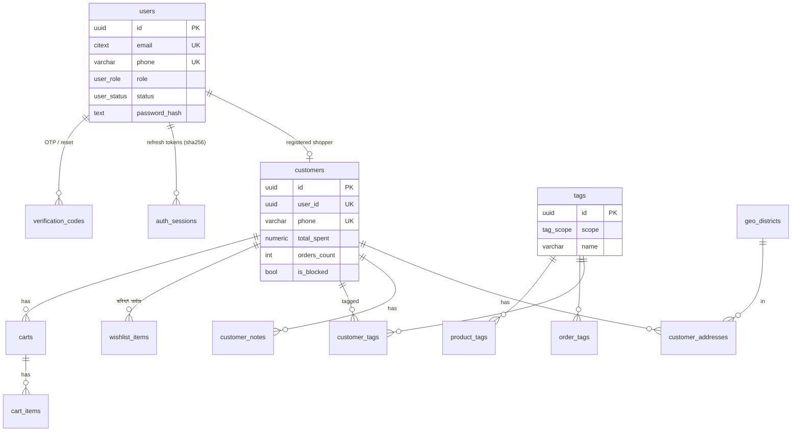
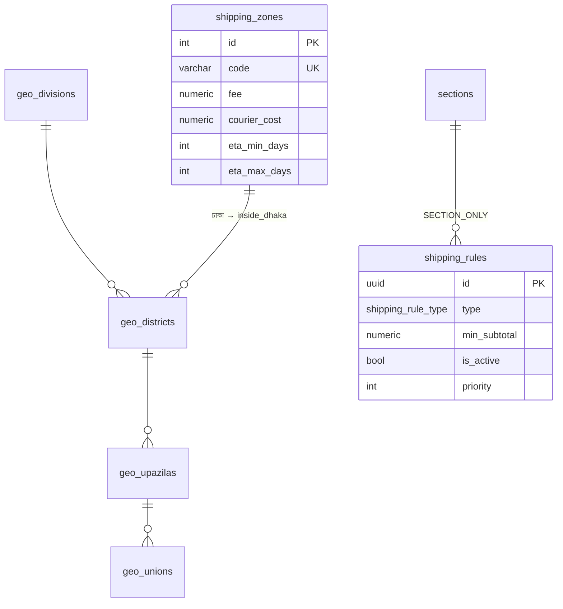
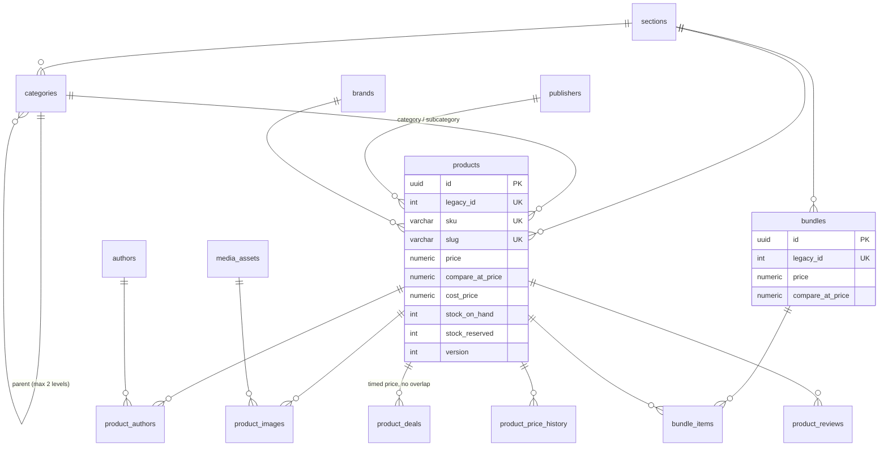
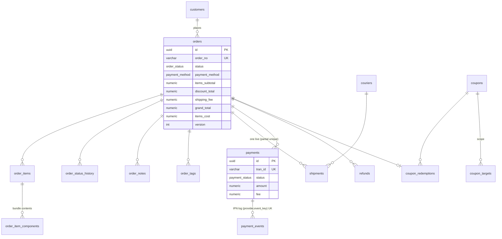
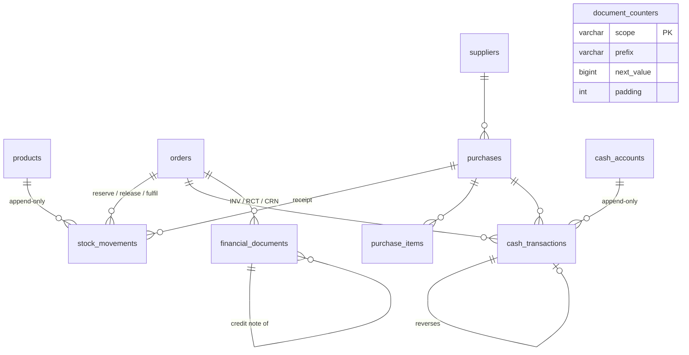
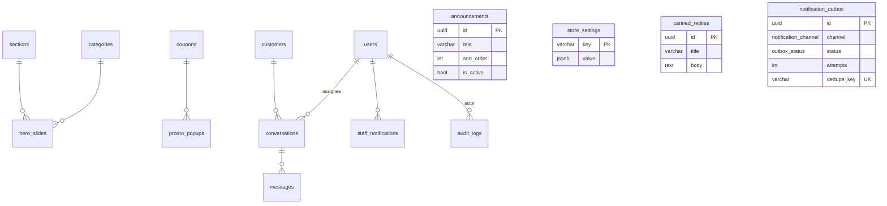

# Database

PostgreSQL 16 (13+ works) through Prisma 6. The schema is in `prisma/schema.prisma`. Two migrations exist:

* `*_init`: the tables Prisma generates.
* `*_constraints`: everything Prisma cannot express: CHECKs, partial unique indexes, the exclusion constraint, trigram indexes, append-only triggers and reporting views.

## Conventions

* **Names.** Tables and columns are `snake_case` in Postgres (`@map`) and `camelCase` in Prisma.
* **Keys.** Primary keys are **UUIDv7** (`uuid(7)`). They are time-ordered, so B-tree inserts stay cheap. Reference data (geo, shipping zones) uses small `Int` ids.
* **Money.** `NUMERIC(12,2)` in BDT, and `NUMERIC(14,2)` for aggregates. It is never a float. The API converts it to a number only in mappers.
* **Time.** Every timestamp is `timestamptz(3)` stored in UTC. Reports convert to `Asia/Dhaka`.
* **Human numbers.** `CLO-2042`, `INV-000001`, `RCT-`, `CRN-` and `PUR-000101` come from `document_counters` inside the business transaction, so they are gapless and race-free.
* **Snapshots.** Orders, order items and financial documents copy names, prices and costs at the moment they are created. Editing a product never rewrites history.
* **Soft delete.** `deleted_at` is used on the catalogue, customers, coupons and addresses. Reads filter `deleted_at IS NULL`.
* **Optimistic locking.** `version` on `products` and `orders` (`UPDATE … WHERE version = $n`).
* **Case-insensitive text.** `citext` for emails and coupon codes.
* **Phones.** E.164 (`+8801XXXXXXXXX`), enforced by CHECK. Customers are keyed by phone.

## Append-only ledgers

These tables accept `INSERT` only. Triggers (`cholo_forbid_mutation`) reject `UPDATE` and `DELETE`, so a mistake is corrected with a reversing entry.

| Table | Truth for | Cached as |
|---|---|---|
| `stock_movements` | Stock: `Σ qty_on_hand_delta`, `Σ qty_reserved_delta` | `products.stock_on_hand`, `stock_reserved` (updated in the same transaction by `InventoryService`) |
| `cash_transactions` | Cash per account: `opening_balance + Σ IN − Σ OUT` (amount always > 0). Corrections set `reverses_id`. | view `v_cash_balances` |
| `financial_documents` | Invoices, receipts and credit notes. Immutable, except that `pdf_key` can be attached once. | – |
| `audit_logs` | Who did what (staff, customers, webhooks) | – |

The seed writes one `OPENING` movement per product the first time it creates that product, so the ledger and the cached balance agree from day one.

## ERD (by domain)

### Identity, CRM and tags

### Geography and shipping

### Catalogue

### Orders, fulfilment and payments

### Inventory, purchasing and accounting

### Content, support, notifications and audit

## Constraints that live in SQL (`*_constraints` migration)

**Catalogue**

* `products`: price ≥ 0, `compare_at_price ≥ price`, cost ≥ 0, `tax_rate` between 0 and 100, stock ≥ 0, reserved ≤ on hand (unless backorder), pages > 0, rating between 0 and 5, subcategory ≠ category.
* The category tree is at most 2 levels deep, and a child must be in its parent's section (trigger `cholo_category_depth`).
* One primary image per product (partial unique index).
* `product_deals`: `ends_at > starts_at`, price > 0, and **no overlapping active deals** per product (GiST exclusion on `tstzrange`).
* `bundles`: `compare_at_price ≥ price`. `bundle_items`: quantity > 0.

**Inventory and purchasing**

* `stock_movements`: the delta is non-zero, `balance_after ≥ 0`, and rows are append-only.
* `purchases`: `total = subtotal + other_charges`, and `0 ≤ amount_paid ≤ total`. `purchase_items`: `line_total = quantity × unit_cost`.

**Customers**

* Phones match E.164 BD. A user has an email or a phone. One default address per customer.
* Polymorphic rows (`wishlist_items`, `cart_items`, `coupon_targets`) point at exactly one target. Cart quantity is between 1 and 99.

**Orders, fulfilment and payments**

* `orders`: amounts ≥ 0, `discount ≤ subtotal`, **`grand_total = items_subtotal − discount_total + shipping_fee + tax_total`**, `refunded ≤ paid`, and CANCELLED/RETURNED orders need `cancelled_at`.
* `order_items`: the `kind` column matches which target is set, quantities are sane, amounts ≥ 0.
* `shipments`: one live shipment per order (partial unique index). `payments` and `refunds`: amount > 0.

**Accounting, promotions and support**

* Cash amount > 0 and append-only. Documents are immutable. Counters are positive.
* Coupon value rules by type, time windows are valid, usage limits are positive.
* `shipping_rules` shape per type: `MIN_SUBTOTAL` needs `min_subtotal > 0`, `SECTION_ONLY` needs a section.
* Review rating between 1 and 5. One open conversation per customer. `audit_logs` are append-only.

**Views and search**

* Views: `v_product_stock` (availability, low-stock flag, stock value), `v_cash_balances`, `v_daily_sales` (Dhaka days).
* Search: trigram GIN indexes on `products.title`, `products.subtitle`, `authors.name_bn` and `customers.name`.

When you add a constraint, add it to a **new** migration (`prisma migrate dev --create-only`, then edit the SQL). The problem+json filter maps `check_violation` to `422 db.constraint`.

## From the frontend's localStorage to tables

The storefront currently keeps everything in `localStorage["cholo_next_v1"]` as `{ lines, vertical, userId, users, orders, coupon, shop, books, admin }`, plus `sessionStorage` flags. This is where each field goes:

| localStorage path (frontend type) | Table(s) | Notes |
|---|---|---|
| `shop.products[]` (`ShopProduct`) | `products` | `id` → `legacy_id`; `title`; `author` → `subtitle`, plus `authors`/`product_authors` for books and `brands` for other sections; `unit`; `price`; `old` → `compare_at_price` (null unless greater than price); `cost` → `cost_price`; `stock` → `stock_on_hand` (plus an `OPENING` stock movement); `copies` → `initial_copies`; `sold` → `sold_count`; `pages`; `color` → `cover_color`; `desc` → `description`; `vertical` → `section_id`; `cat` / `sub` → `category_id` / `subcategory_id`; `freeShip` → `free_shipping`; `image`, `image2` → `media_assets` + `product_images` |
| `shop.products[].deal` (`PriceDeal {price, until}`) | `product_deals` | `deal_price`, `ends_at` |
| `shop.packs[]` (`ShopPack`) | `bundles`, `bundle_items` | `bookIds` → items; `old` → `compare_at_price` |
| `catalog.verticals`, `shop.hiddenVerticals` | `sections` | Hero copy goes in the `hero_*` columns and the `content` JSON. Hidden sections have `is_visible = false`. |
| cats.ts trees, `shop.extraCats`, `shop.hiddenCats` | `categories` | 2-level tree; `is_visible` |
| `catalog.slides` | `hero_slides` | `img` → `image_url`; `cat` → `category_id` |
| `shop.ticker[]` | `announcements` | |
| `shop.coupons[]` (`ShopCoupon`) | `coupons` | `pct` → `PERCENT`, `tk` → `FIXED`; `active` → `is_active` |
| `shop.promo` (`PromoSettings`) | `promo_popups` | `code` → `coupon_id`. The "seen" flag stays client-side (`sessionStorage.cholo_promo_seen`). |
| `shop.ship` (`ShipSettings`) | `shipping_zones`, `shipping_rules`, `store_settings` | `dhaka`/`costDhaka` → `inside_dhaka` fee/cost; `outside`/`costOutside` → `outside_dhaka`; `freeAbove`/`freeAboveOn` → `MIN_SUBTOTAL`; `freeOnPack` → `ANY_BUNDLE`; `freeOnBooks` → `SECTION_ONLY(book)`; `freeAllOn`/`freeFrom`/`freeTo` → `CAMPAIGN_ALL` with a window; `sslFeePct` → `store_settings.gateway_fee_pct` |
| `shop.chats[]` (`ChatThread`, `ChatMsg`) | `conversations`, `messages` | `from: user/agent` → `sender: CUSTOMER/STAFF` |
| chat.tsx `QUICK_REPLIES` | `canned_replies` | |
| `users[]` (`DemoUser`), `userId` | `users` (+ `customers`) | Passwords become argon2id hashes. The session becomes JWT access tokens plus `auth_sessions`. `wait[]` → `wishlist_items`. |
| `lines[]` (`CartLine {kind,id,n}`), `coupon` | `carts`, `cart_items` (`coupon_code`) | `kind: book` → `product_id`, `pack` → `bundle_id` |
| `orders[]` (`DemoOrder`) | `orders` | `id` → `order_no`; `status` (−1…5) → `order_status` (PENDING, CONFIRMED, PROCESSING, HANDED_TO_COURIER, OUT_FOR_DELIVERY, DELIVERED, CANCELLED); `pay` → `payment_method`; `paid` → `payment_status`; `sub` → `items_subtotal`; `couponOff` → `discount_total`; `ship` → `shipping_fee`; `shipCost` → `courier_cost`; `total` → `grand_total`; `address` → `ship_*` snapshot columns; `stockHeld` → `stock_reserved`; `confirmedAt`/`cancelAt` → timestamps and `cancelled_from` |
| `orders[].lines[]` (`OrderLine`) | `order_items` (+ `order_item_components` for packs) | `price` → `unit_price`; `cost`/`costKnown` → `unit_cost` (null when unknown) |
| `admin.orderMeta[id]` (`OrderMeta`) | `order_notes`, `order_tags`, `orders.priority`, `shipments`, `order_status_history` | `courier {name, tracking}` → `shipments.courier_id`, `tracking_no` |
| `admin.customerMeta[phone]` (`CustomerMeta`) | `customers.admin_note`, `is_blocked`, `customer_tags` | |
| `admin.activity[]` (`Activity`) | `audit_logs` | `kind` → `area` |
| `admin.prefs` (`AdminPrefs`) | `users.preferences` (per staff member), `store_settings.default_low_stock_threshold` | |
| `ORDER_TAGS`, `CUSTOMER_TAGS` | `tags` (`scope`) | |
| `books.papers[]` (`Paper`) | `financial_documents` | `kind: invoice/receipt/credit` → `INVOICE/RECEIPT/CREDIT_NOTE`; `lines` go into the JSON snapshot |
| `books.purchases[]` (`Purchase`) | `purchases`, `purchase_items`, `suppliers`, and `cash_transactions` when paid | `supplier` (free text) → a `suppliers` row |
| `books.cash[]` (`CashEntry`) | `cash_transactions` | `account` → `cash_accounts.code` (ক্যাশ → cash, বিকাশ → bkash, নগদ → nagad, ব্যাংক → bank); `kind` ssl/cod/fee/purchase/refund/courier/manual → `GATEWAY_SETTLEMENT`/`COD_REMITTANCE`/`GATEWAY_FEE`/`PURCHASE_PAYMENT`/`REFUND`/`COURIER_PAYMENT`/`MANUAL` |
| `books.seq`, `admin.seq` | `document_counters` | |
| `lib/geo.ts` `GEO` | `geo_divisions` → `geo_districts` → `geo_upazilas` → `geo_unions` | 8 divisions, 64 districts, 315 upazilas, 958 unions |

## Seed contents

After `npx prisma db seed` on an empty database:

| Group | Rows |
|---|---|
| Geo | 8 divisions · 64 districts · 315 upazilas · 958 unions |
| Shipping | 2 zones · 4 rules (only `MIN_SUBTOTAL ৳500` is active) |
| Catalogue | 3 sections · 33 categories · 14 authors · 2 brands · 42 products (34 `OPENING` movements; products at zero stock get none) · 51 images · 3 bundles / 7 items |
| Operations | 6 couriers · 5 cash accounts · 5 document counters (order `CLO-` 2042/pad 4, `INV-`/`RCT-`/`CRN-` 1/pad 6, `PUR-` 101/pad 6) |
| Content | 2 coupons · 3 announcements · 1 promo popup · 12 hero slides · 5 canned replies · 4 store settings · 12 tags |
| Users | OWNER `admin@cholo.shop` · customer `rafi@gmail.com` / `+8801711111111` with a `customers` row |

## Operational notes

* **Connection pool.** Prisma's pool is `connection_limit` in `DATABASE_URL`; compose defaults it to 10. With PgBouncer in transaction mode, put the pooled URL in `DATABASE_URL` and a direct URL in `DIRECT_URL`.
* **Slow queries.** The compose Postgres logs queries slower than `PG_LOG_SLOW_MS` and loads `pg_stat_statements`. Run `CREATE EXTENSION pg_stat_statements;` once to query it.
* **Backups and restore.** See [deployment.md](deployment.md#backups).
